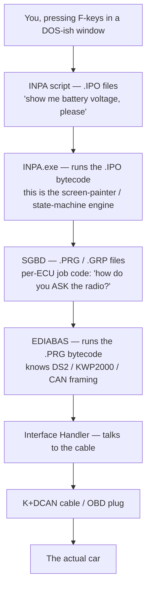
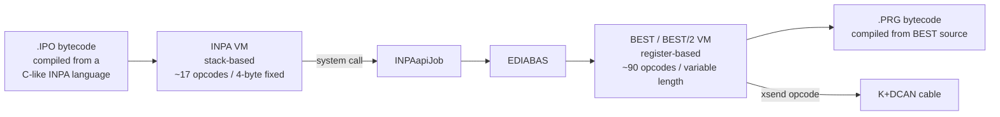
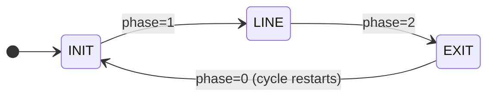
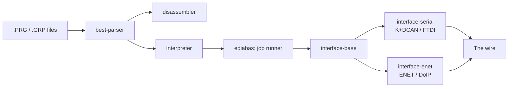
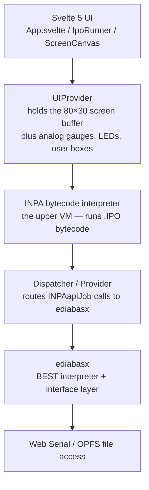

# Resurrecting BMW Diagnostics in the Browser

*Or: how I stopped dual-booting Windows and reverse-engineered a 25-year-old toolchain so my car would talk to my MacBook.*

<!-- SCREENSHOT: Hero shot — the inpax web UI running an INPA script next to the original INPA window on a Windows VM, side by side. Both showing a Battery / Ignition status screen. Caption: "Left: 1998. Right: 2026. Same job." -->

## The thing about old BMWs

You own a 20-year-old car, or you don't. If you do, you already know what I mean — that quiet, satisfying knowledge that the hardware in your garage was over-engineered by people who didn't yet have the option of being lazy about it, and that with a bit of patience it will outlast everything around it. The engine doesn't care that it's 2026, and neither does the wiring loom, nor the ECU sitting under the passenger seat that was state-of-the-art when *The Matrix* came out.

What does care, unfortunately, is the *tooling*. The thing you use to ask the car questions. To pull a fault code. To check why the cold-start is rough. To watch the lambda sensors warm up. That tooling — for the old BMWs I'm talking about, the E36 / E38 / E39 / E46 era — is INPA, EDIABAS, and a constellation of supporting binaries that were last meaningfully updated some time around when nu-metal was still on the radio. It runs on Windows. It runs on Windows the way old things do: through XP-shaped potholes, with INI files and registry tweaks and a USB-to-serial driver that has Opinions. If you've installed it, you've fought it.

I don't run Windows. I haven't for years. The choice in front of me, when I bought the car, was a familiar one: dual-boot forever, or build the alternative.

You can probably guess which way I went.

This is the story of two TypeScript projects — **[ediabasx](https://github.com/emdzej/ediabasx)** (an EDIABAS runtime, reimplemented from scratch) and **[inpax](https://github.com/emdzej/inpax)** (the INPA scripting environment, also reimplemented, also from scratch, also living in a browser tab now) — and the long process of taking BMW's two-decades-old toolchain apart in Ghidra, understanding it, and rebuilding it in a stack you can run on a MacBook, a Linux box, a phone (eventually), or anything else with a Chromium-based browser and a USB port.

It's also a story about right-to-repair, about the joy of obsolete-but-loved hardware, and about why your intuition will lie to you when you're three function-graphs deep inside a binary that hasn't seen daylight in fifteen years.

I'll try to keep it concrete — concrete code, concrete diagrams, and the occasional embarrassing detour I went on because I read the disassembly too fast.

Let's start at the bottom.

## What you're actually looking at when you look at INPA

Before I touched a disassembler I needed to understand the *shape* of the thing. INPA isn't one program. It's a stack, and the stack matters, because you can't replace the top without understanding what it sits on.



Two virtual machines stacked on top of each other. Both interpreting BMW's own undocumented bytecode formats. Both shipped as 32-bit Windows DLLs. Both with their own little zoo of opcodes, their own stack representation, their own opinions about what a string is.

The `.IPO` files (you'll find dozens of them in `EC-APPS/INPA/SGDAT/`) describe **screens and workflows**. Things like *"when the user presses F1, display the menu titled 'Engine Diagnostics', and when they pick 'Fault Codes', run the FS_LESEN job on the DME and display each fault on its own LINE block"*. This is the user-visible layer. This is what you write if you're a BMW engineer who needs to add a new diagnostic screen for a new model.

The `.PRG` files (lurking in `EDIABAS/Ecu/`) describe **how a specific ECU is queried**. Things like *"to read battery voltage from this DME, send these exact bytes, wait for the response, divide byte 7 by 7.41, that's volts"*. This is the protocol layer. This is what you write if you're a BMW engineer who needs to add support for a new ECU.

Both languages are BMW-internal. Neither has public documentation. Both compile to bytecode, which is the part you can actually take apart.

The runtime that interprets `.IPO` is INPA.exe. The runtime that interprets `.PRG` is EDIABAS — specifically `Best32.dll`, which is the BEST bytecode interpreter, paired with `OBD32.dll`, which handles the lower-level cable side (DS2, KWP2000, CAN framing, timing, the whole physical-layer ceremony). Together they're the cake. The cable on the OBD-II port is the fork. The car is dinner.

<!-- SCREENSHOT: A directory listing of an INPA install — the EC-APPS/INPA/SGDAT folder with dozens of .IPO files like ms43.ipo, radio.ipo, etc. Caption: "Twenty-five years of BMW model coverage, one folder." -->

This is the moment to mention an enormous piece of prior art. **[EdiabasLib](https://github.com/uholeschak/ediabaslib)**, by Ulrich Holeschak, is a C# reimplementation of EDIABAS that's been actively developed since well before I started looking at any of this. Ulrich and the community around him have already done the hard half of the work — figuring out the BEST opcode set, the cable protocols, the variations between different generations of BMW diagnostic hardware — and have published all of it as open source. EdiabasLib is the difference between *"this is a six-month project"* and *"I should have started a podcast instead"*. I'll link it again later, properly. For now: please go star it.

But — and this is the key — Ulrich's work covers EDIABAS. The lower VM. The `.PRG` interpreter. It doesn't cover INPA itself — the upper VM, the screen runtime, the `.IPO` interpreter. That part I'd need to do from the binary, with Ghidra, and with a lot of coffee.

So that's what I did.

## Two languages, two VMs, two very different machines

Before we go any further, it's worth understanding what's actually inside those `.IPO` and `.PRG` files. They're both bytecode. Both produced by BMW-internal compilers from BMW-internal source languages. Both interpreted by their own VM. But the VMs are architecturally different in a way that shaped almost every implementation decision I made.

The lower VM, the one EDIABAS interprets, is **register-based** — like x86, or AVR, or any of the embedded-CPU architectures the people who designed it would have been used to. It has a fixed set of typed registers: `S0`-`S7` for strings, `L0`-`L7` for longs, `B0`-`B7` for bytes, `I0`-`I7` for ints. Operations name their operands explicitly: *"clear `S1`, then move bytes into `S1`, then transmit `S1` via xsend"*. The language EDIABAS compiles to bytecode is commonly called **BEST** (Bavarian Embedded Standard Tester), with a later evolution called **BEST/2** that adds opcodes and refines a few semantics. Both compile down to the same general bytecode family and run on the same VM; from an implementation perspective they're two dialects of one machine.

The EDIABAS opcode set is broad — roughly 90 distinct instructions in the runtime I've implemented — and it carries a lot of domain knowledge directly in the language. There are opcodes for sending and receiving DS2 telegrams (`xsend`, `xsendr`), opcodes for writing result fields by name (`ergs`, `ergy`, `ergi` — string, byte-array, int respectively), opcodes for table lookup (`tabset`, `tabseek`, `tabget`), opcodes for string manipulation (`strcat`, `serase`, `strlen`, `midstr`), opcodes for converting between numeric representations (`fix2hex`, `hex2fix`, `atsp`).

BEST instructions are variable length. A given opcode might be one byte plus an operand, or one byte plus two operands, or include an inline literal of arbitrary length. There's no fixed-size word. The disassembler has to know, opcode by opcode, how many bytes to consume next.

A BEST job looks like this in our disassembler's output (this is the radio's `IDENT` job, the one that asks the radio to identify itself):

```
IDENT @ 0x146A
  [0000146A] clear      S1
  [0000146D] move       S1,S2
  [00001471] push       #$1.L
  [00001477] clear      S1
  [0000147A] move       S1,{$68.B,$04.B,$00.B}
  [00001482] push       #$1.L
  [00001488] clear      S2
  [0000148B] xsend      S2,{$68.B,$04.B,$00.B}
```

Register-named, string-centric, low-level. The mental model is closer to a 6502 assembler than to anything modern. There's no concept of structured types — strings are just byte buffers — and the fancy stuff (job dispatch, result formatting, parsing) all happens through specific opcodes that the runtime implements specially.

The upper VM, the one INPA.exe interprets, is **stack-based** — the same architectural family as the JVM, the CLR, Forth, and most of the bytecode VMs you've probably touched as a developer. There are no named registers. Operations push and pop values from an implicit value stack: *"push global[9] (the string 'D_0068'), then push the constant 'INITIALISIERUNG', then call INPAapiJob — it'll consume the top two values".* The instructions don't name what they operate on; they operate on whatever is currently on top of the stack.

INPA's instruction format is also much narrower: about 17 distinct opcodes, each instruction fixed at exactly 4 bytes — opcode byte, type/scope byte, then a 16-bit operand. You can walk through a `.IPO` file with a `for` loop incrementing by 4 each time. (You absolutely cannot do that with BEST.)

```
 byte 0   byte 1   bytes 2-3
┌────────┬────────┬──────────────────┐
│ opcode │ type / │  index / value   │
│        │ scope  │  (little-endian) │
└────────┴────────┴──────────────────┘
                                = 4 bytes per instruction
```

INPA expresses its domain knowledge as **system functions** rather than as opcodes. The INPA runtime ships about 160 of them — `setscreen`, `setmenu`, `setstate`, `text`, `analogout`, `digitalout`, `INPAapiJob`, `INPAapiResultText`, and so on. An INPA program calls these via a single `CALL` opcode (`0x0C`) with a flag byte (`0x81`) marking it as a system call rather than a user function call. So INPA bytecode looks like high-level code with system-call instructions interspersed:

```
0014: [0C 81 62 00] CALL         sys INPAapiJob
0015: [0F 00 00 00] FRAME ; push call frame
0099: [0C 81 69 00] CALL         sys INPAapiCheckJobStatus
```

…and the runtime does the heavy lifting in C++. INPA programs are more like glue code that orchestrates calls into the runtime's library; BEST programs are more like detailed protocol-level recipes that build telegrams byte by byte.

The relationship between the two VMs is hierarchical. When an INPA program (an `.IPO`) calls `INPAapiJob("RADIO", "IDENT", ...)`, the INPA runtime calls into EDIABAS, which loads `RADIO.PRG`, finds the `IDENT` BEST job, runs *that* on the lower VM, gets the response from the radio, parses it, stores result fields. Control returns to the INPA program, which reads those result fields via more system functions and decides what to display on screen.



In `ediabasx` and `inpax` I implemented both VMs in TypeScript. They live in separate packages (one per project), they have different test suites, they share nothing in code. The architectures *look* superficially similar at first — both have a `step` function that dispatches on opcode, both have some kind of operand storage, both have local/global variable arrays — but the implementations diverged within the first thousand lines because *stack-based* and *register-based* are fundamentally different shapes, and one of them wanting to be the other doesn't work out well.

The reason this matters for the article is that **the reverse engineering story is different for each layer**, and I want to be precise. For EDIABAS, I leaned heavily on prior work (EdiabasLib's mature C# implementation, with all its register-handling already pinned down). For INPA, I worked from the binary, with Ghidra, mostly alone — and the very first thing I had to figure out was the stack discipline. The next section is about that.

## Reading the bones: opening up INPA.exe

I dropped `INPA.exe` into Ghidra one Friday evening. The file is a 32-bit MFC application, no debug symbols (of course), no exports of interest (Windows GUI apps don't really export anything), and the function names that Ghidra produces during initial analysis are all of the form `FUN_004607d7` — *"I see a function here, somebody who isn't me should figure out what to call it"*.

<!-- SCREENSHOT: Ghidra's symbol tree showing the wall of FUN_xxxxxxxx functions, before any renaming. Caption: "The starting position. Roughly two thousand of these." -->

The first goal, when you're reverse-engineering anything with a scripting language, is to find the **bytecode interpreter**. The interpreter has a shape. Once you've recognised that shape once, you can find it in any VM written in the last forty years.

Here's the shape: somewhere in the binary, there's a function that reads a byte from a code pointer, switches on it, and does something different in each `case`. If the cases run from `0x01` to about `0x20`, and the function reads more bytes from the code pointer after the switch, you've found the interpreter. That's it. That's the trick.

I went looking for a giant `switch`. Ghidra's decompiler renders these readably, so it's mostly a matter of scrolling. Twenty minutes in, I had it at `0x004607d7`.

I renamed it `INPA_VM_Interpret`. Here's the shape of it — and please note, this is **my reconstruction**, written in the form I'd build it if I were implementing the same algorithm myself, not BMW's source:

```c
// INPA_VM_Interpret — single-step the bytecode VM.
// Returns 1 if it executed an instruction, 0 if we hit end-of-block.
int INPA_VM_Interpret(VM* vm, int context) {
    if (vm->ip >= vm->code_size) {
        return 0;                                    // we're done
    }

    uint32_t instr = read_instr(vm->code_ptr, vm->ip);
    uint8_t  op    = instr & 0xff;
    uint8_t  type  = (instr >> 8) & 0xff;
    uint16_t arg   = (instr >> 16) & 0xffff;

    switch (op) {
        case 0x01: /* LOAD     */ push_value(stack, arg); break;
        case 0x05: /* MOVE     */ /* assign top to ref */ break;
        case 0x08: /* ALLOC    */ /* allocate local */ break;
        case 0x09: /* ALU      */ alu_op(vm, type); break;
        case 0x0a: /* JMP      */ vm->ip = arg; return 1;
        case 0x0b: /* JMPNZ    */ if (vm->cond == 0) vm->ip = arg; else vm->ip++; return 1;
        case 0x0c: /* CALL     */ dispatch_call(vm, type, arg); break;
        case 0x0e: /* RET      */ /* pop frame */ break;
        // ... and so on for 0x01..0x11
    }

    vm->ip++;
    return 1;
}
```

The thing that locked it all in was figuring out that **every INPA instruction is exactly 4 bytes**. Once I noticed that the function consistently advanced its instruction pointer by *one* (not two, not four) but always read *four bytes worth* from the code stream, the format clicked. The first byte is the opcode (so up to 256 of them, in practice about seventeen are used). The second byte is a "type" or "scope" qualifier — for LOAD instructions, it says whether the operand is global, constant, local, screen, menu, or state-machine; for CALL instructions, it says whether you're calling a user-defined function or a system built-in. The remaining two bytes are an index or immediate value, little-endian (because of course they are; INPA was written by people who'd been using x86 their whole career).

Once you know that, the entire `.IPO` file decodes mechanically. There's no fancy variable-length encoding, no relocation table, no obfuscation. It's just a flat stream of 4-byte words. I built a disassembler in a couple of hours:

```typescript
// packages/disassembler — about as straightforward as it sounds
const instr = readU32LE(code, ip);
const op    = instr        & 0xff;
const type  = (instr >> 8) & 0xff;
const idx   = (instr >> 16) & 0xffff;

const mnemonic = OPCODES[op] ?? `??(${hex(op)})`;
console.log(`  ${hex(ip, 4)}: [${bytes(instr)}] ${mnemonic}  ${operand(type, idx)}`);
```

And then I pointed it at `radio.ipo`, which is the script for talking to the old BM5x-series BMW radios, and got this:

```
; ========================================
; Function: inpainit
; Block ID: 2
; ========================================
  000e: [0C 81 60 00] CALL         sys INPAapiInit
  0010: [01 00 09 00] LOAD         global[9]     ; "D_0068"
  0011: [01 01 70 04] LOAD         const[1136]   ; "INITIALISIERUNG"
  0014: [0C 81 62 00] CALL         sys INPAapiJob
```

(That second LOAD is loading the string `"D_0068"` from global slot 9 — that's the SGBD name. `D_0068` is EDIABAS shorthand for *"address 0x68 on the diagnostic bus"*, which is where the radio lives. The third LOAD picks up `"INITIALISIERUNG"`, the name of the job that initialises an EDIABAS session. The whole thing is INPA telling EDIABAS *"open a session with the radio".*)

<!-- SCREENSHOT: Our CLI disassembler output for radio.ipo's inpainit function, with the colourful highlighting on — opcodes in cyan, comments in grey. -->

I want to be honest about how much time I spent being wrong before I got here. For an entire evening I was convinced that `INPAGER.DLL` — a 114 KB DLL sitting next to INPA.exe in the BIN folder, named exactly like a thing called "INPA Pager" — must be where the page-scrolling logic lives. INPA screens that have more LINE blocks than fit on the visible area paginate, you press arrow keys, they scroll. That's a pager. The DLL is called `inpager`. Right?

Loaded it into Ghidra. It exports two functions. They both return version strings. It's a *version-info utility*. It is, functionally, a digital sticker on the side of the box that says "made in 2010". The actual pager is buried inside INPA.exe behind an MFC `WM_VSCROLL` message map that Ghidra's analyzer politely refuses to expand. I lost an entire evening to that DLL. I have aged.

(There's a real lesson in here, and the lesson is *"never trust filenames"*, especially when the filenames are German abbreviations from the early 2000s. Things called INPAGER are not necessarily pagers, and the BIN folder generally is a cemetery of three-letter DLLs whose names tell you almost nothing about what they actually do. The map is not the territory; the filename is not the function.)

## A digression about being wrong, because it happens a lot

Here's a thing nobody warns you about reverse engineering: **you will be confidently wrong in both directions on the same question, hours apart.** You'll convince yourself a function does X. You'll write code assuming X. Two days later, in the disassembly of an entirely different function, you'll see something that contradicts X. You'll panic. You'll rewrite. Then a week later you'll notice the contradicting evidence was actually consistent with X all along, and you've now broken your own code trying to fix something that was never broken.

This happened to me three times on the screen execution model alone.

INPA scripts describe screens like this:

```
SCREEN s_battery, TRUE {
    INIT { settimer(0, 1000); }
    LINE(0, "Battery") {
        INPAapiJob("DME", "STATUS_BATTERY", "", "");
        ...
    }
    LINE(1, "Ignition") { ... }
    LINE(2, "Coolant") { ... }
    EXIT { ... }
}
```

The `TRUE` flag makes it a **frequent** screen — *please refresh continuously while it's active*. There are multiple LINE blocks. The question I needed to answer was: when INPA gets one slice of CPU time, does it run **all** the LINE blocks, or just one?

This sounds like a small question. It's actually load-bearing for the whole renderer architecture. If INPA runs all LINEs per tick, then you can render the screen atomically at the end of each tick, and the user never sees a half-updated state. If INPA runs one LINE per tick, then you need a different model — probably some kind of "double-buffer per LINE row" — to avoid the same flicker.

I built the first implementation assuming "all LINEs per tick". It worked. Things rendered. I moved on.

Then, weeks later, while spelunking through the disassembly of `FUN_00420745` for a different reason, I noticed a state machine. There was a field at offset `+0xe8` of the screen context that took values `0`, `1`, `2`, and there was a switch on that value, and each case loaded a different block of code. *Surely* each value was one LINE block. *Surely* I'd been wrong.

I spent four evenings unconvincing myself of something that turned out to be correct.

The state machine isn't per-LINE. It's per-**phase**: 0 is INIT, 1 is LINE, 2 is EXIT. The whole cycle runs in three ticks, except that within the LINE phase, the entire concatenated LINE bytecode (all blocks, one after another, looped) runs to completion in that tick. My original implementation was right.



Here's the shape of what `INPA_RunBlockPhase` (my rename for the screen-tick function) actually does — again, my reconstruction, not BMW's source:

```c
void INPA_RunBlockPhase(ScreenCtx* ctx) {
    if (paused) return;

    if (ctx->phase == 1 /* LINE */) {
        load_code_block(vm, ctx->lineCode);  // ip = 0, code_size set
        do {
            iVar1 = INPA_VM_Interpret(vm, ctx->lineListHead);
        } while (iVar1 != 0 && ctx->runningFlag == 1);
        ctx->phase = 2;   // next tick will do EXIT
    }
    // ... INIT and EXIT cases similar
}
```

That tight `do { Interpret } while (more && running)` loop is the whole story. INPA single-steps its VM (each call to Interpret runs one instruction), but it single-steps it through the *entire* LINE block every tick.

The lesson, if you want one: **reverse engineering is not deduction, it's hypothesis-testing**. You form a model. You check the model against new evidence. Sometimes the model survives, sometimes you have to rewrite it. The thing you can't do is be confident that you've gotten it right after only one piece of evidence. The disassembly doesn't tell you what something does; it tells you what it could be doing, and you have to keep going until that possibility space narrows.

I keep the renamings now, so I don't go through this again:

| Address | Original | Renamed |
|---|---|---|
| `0x004607d7` | `FUN_004607d7` | `INPA_VM_Interpret` |
| `0x00420745` | `FUN_00420745` | `INPA_RunBlockPhase` |
| `0x004176fb` | `FUN_004176fb` | `INPA_RunStatusDispatcher` |
| `0x00402d7c` | `FUN_00402d7c` | `INPA_MainAppStateStep` |
| `0x004014a5` | `FUN_004014a5` | `INPA_OnIdleStep` |

And in the docs folder of the inpax repo I keep a markdown file called `screen-execution-model.md` that explains all this, partly so I don't forget, and partly so when someone else opens INPA.exe in Ghidra in five years they don't have to start at zero. (If you're that person: hello. You're welcome. Bring snacks.)

<!-- SCREENSHOT: Ghidra split-pane showing the decompiled INPA_RunBlockPhase next to the matching TypeScript implementation in our screen-executor.ts. Caption: "The same algorithm, twice. The right side is mine; the left side is BMW's, with the names I picked." -->

## ediabasx: where the actual bytes come from

INPA is the top of the cake. EDIABAS is the cake. Reverse-engineering INPA without reimplementing EDIABAS first would have been like building a kitchen without a stove — you can lay out the counters all you like, you're not cooking anything.

EDIABAS, as established a couple of sections back, runs BEST bytecode. When INPA's `INPAapiJob("RADIO", "IDENT", …)` runs, EDIABAS loads `RADIO.PRG`, finds the BEST job called `IDENT`, runs it, and that job eventually emits some specific bytes over the cable and parses the response.

I had two huge advantages here that I did not have for INPA.

First, **EdiabasLib already exists**, and its C# implementation is exhaustive. Ulrich's done the BEST opcode mapping, the cable protocols, the variations across cable generations, the timing constants — all of it. I can read his C# implementation alongside the original `Best32.dll` decompilation in Ghidra and cross-reference. When something looks weird in Ghidra, EdiabasLib usually has a comment explaining what's actually happening. When something looks weird in EdiabasLib, the Ghidra view usually clarifies it. Together, they're a Rosetta Stone.

That probably sounds abstract, so let me make it concrete: without Ulrich's work, I'd have spent a lot more late nights with the NSA's reverse-engineering tool (yes, Ghidra is theirs — it's an awkward little fact you stop noticing after a while) trying to derive, by myself, what BMW means by a register-based VM with eight string registers and a value stack and these specific opcodes that have specific timing requirements. EdiabasLib already had it laid out, in C#, with comments. **That is the power of open source**: someone has already done the part you don't want to do, they've given it to you for free, and they're still maintaining it. You owe them, and the best way to pay them back is to do the same thing for the next person.

Second, **the BEST format has been documented**. Not officially — BMW has never published a BEST language spec. But fragments exist online, EdiabasLib's source comments fill in most of the gaps, and the decompiled headers (`Best32.dll.h`, `OBD32.dll.h`) give you outlines of the runtime API. It's not a complete specification, but it's enough to start.

So `ediabasx` was, in a structural sense, a port-with-rewrites rather than a discovery project. The interesting work was making it run somewhere EDIABAS itself was never designed to go: a browser tab, a Node.js CLI, an Apple Silicon MacBook. EdiabasLib targets .NET Framework. I needed something `pnpm` could install and something a browser could execute.

The architecture mirrors EDIABAS but the runtime is brand new TypeScript:



There are roughly twelve packages now. The interesting ones are:

- **`best-parser`** — takes the binary `.PRG` file and produces a structured AST: jobs, tables, ECU info, constants, code blocks
- **`disassembler`** — turns BEST bytecode into the readable assembly you saw above
- **`interpreter`** — the actual VM, with about 90 opcodes implemented
- **`ediabas`** — the orchestration layer, job runner, result storage
- **`interface-base`** — the abstract "a thing that can talk to a car" interface
- **`interface-serial`** — the K+DCAN / FTDI implementation
- **`interface-enet`** — the ENET / DoIP implementation for newer cars

The BEST disassembler is the first piece that *worked* — meaning, the first piece that produced output I could compare against a known-good reference (specifically, against `ediabas /R` running the same job on a Windows VM). When that started agreeing, I knew the parser was right. When that disagreed, I had a parser bug. The disassembler is a parser-validator, basically.

Here's `STEUERN_VOL_UP` (the radio's "volume up" job) disassembled by our tooling. I think this is genuinely beautiful, and if you don't, well, your priorities are different from mine:

```
STEUERN_VOL_UP @ 0x7C86
  ; ... value-clamp boilerplate ...
  [00007D41] clear      S1
  [00007D44] move       S1,{$68.B,$05.B,$0C.B,$05.B}
  [00007D53] xsend      S2,{$68.B,$05.B,$0C.B,$05.B}
  ; ... response-parse boilerplate ...
```

Four bytes: `0x68 0x05 0x0C 0x05`. Destination address `0x68` (the radio's address on the diagnostic bus), length `0x05`, command `0x0C` (which BMW calls "Vehicle Control"), sub-code `0x05` (volume up). The BEST runtime computes the XOR checksum and shoves the result down the K-line. The radio gets the bytes, increments its internal volume by one, sends back an acknowledgement.

That's the **entire DS2 protocol**. A destination address, a length, a payload, a checksum. The diag tool's "source address" isn't part of the frame — the protocol assumes the diag tool is the only thing on the other end of the conversation. Five bytes total, including the checksum. Pre-OBD-II BMW diagnostic tooling, in five bytes, designed in the early '90s and still working today.

Different jobs use different commands. Reading fault codes is `0x04`. Clearing them is `0x05`. Reading manufacturing data is `0x53`. Identifying yourself is `0x00`. There are about thirty commands the radio understands, organised into a few rough categories — diagnostic info, fault management, real-time control, configuration. Most BMW ECUs from this era use roughly the same command set, with different specific bytes meaning different specific things depending on what the ECU does.

(There's a fun comparison to be drawn here with my older sibling project, **[bimmerz](https://github.com/emdzej/bimmerz)**, which is an I-bus monitoring SDK that listens to the *peer-to-peer* messages between BMW modules. That uses an entirely different framing — `[SRC][LEN][DST][payload][CHK]`, the source byte explicit — and an entirely different command space. The same radio understands both: command `0x0C 0x05` over DS2 means "volume up" from the diag tool; command `0x32 0x11` over I-bus means "volume up one step" from the BMBT. The hardware has two diagnostic personalities. Or three, if you count the test pattern. We'll come back to this.)

Once the BEST VM was running, I could build the layers above it:

- **`ediabasx jobs <PRG>`** — list every job in a PRG with its arguments and result fields, formatted from the binary's metadata
- **`ediabasx run <PRG> <JOB>`** — execute a job against a live cable
- **`ediabasx disasm <PRG> <JOB>`** — print BEST assembly for any job in any PRG
- **`ediabasx tui`** — an interactive cell-grid terminal UI for hunting through ECUs

```typescript
// apps/cli/src/commands/run.ts — about as complex as it needs to be
const prg = await loadPrg(filePath);
const interpreter = new Interpreter(prg, { interface: serial });
const result = await interpreter.runJob(jobName, args);
console.log(formatResult(result));
```

And then, the first time I plugged in a real K+DCAN cable, pointed it at my car, and asked the DME for its identity, it answered. The response came back as a hex dump on my terminal: model number, software version, hardware revision, build date. The exact same bytes the engineers who designed that ECU had encoded into it twenty years earlier, now decoded by a tool that didn't exist twenty years ago.

That was a good day.

<!-- SCREENSHOT: ediabasx CLI showing `ediabasx run RADIO.prg IDENT` with the request and response telegrams in hex, plus the decoded result fields (ID_BMW_NR, ID_SW_NR, etc.) Caption: "A radio introduces itself." -->

## Web Serial, or: the API that makes all of this possible

Here is a fact that surprised me, and possibly should not have, because if you'd asked me I would have said *"sure, it makes sense that browsers can talk to a serial port"* without ever having actually checked: **modern browsers can in fact talk to a serial port, today, in production, without any extension or plugin or native helper.**

The [Web Serial API](https://developer.mozilla.org/en-US/docs/Web/API/Web_Serial_API) is real, shipping in Chromium-family browsers (Chrome, Edge, Brave, Opera, Arc), and works almost exactly like Node.js's `serialport` module. One call:

```typescript
const port = await navigator.serial.requestPort();
```

…pops a permission dialog, the user picks a device, and you get a `SerialPort` object that you can `open()`, read from, write to, and configure. The browser remembers the permission. Next time the user loads your page they don't have to re-pick the device. There is no install. There is no driver wrapper. There is no Electron.

I want to be clear about how much this changes things. Without Web Serial, building a browser-based diagnostic tool would have required either:

- Shipping a desktop app — which means dealing with macOS code-signing, Windows code-signing, Linux packaging variations, electron-builder fights, and re-doing the UI for each platform if I wanted it to feel native (or accepting that it would feel like a webpage in a window, which is what Electron looks like)
- Shipping a tiny daemon plus a web frontend talking to it over websockets — which means *every user has to install something* and trust the something not to be malware
- Giving up and dual-booting forever

Web Serial deletes those options. The page is a static SPA. The cable is a peripheral of the browser tab. The user goes to a URL, clicks Connect, picks their cable, and they're talking to their car. That's the entire onboarding flow.

<!-- SCREENSHOT: Chrome's "Select a serial port" permission dialog with a K+DCAN cable highlighted. -->

The API itself has some sharp edges, but they're learnable. Writing is easy:

```typescript
const writer = port.writable.getWriter();
await writer.write(new Uint8Array([0x68, 0x04, 0x00, 0x6c]));  // IDENT to radio
writer.releaseLock();
```

Reading is harder than it looks, because there's no built-in *"read N bytes with a timeout"* — the API gives you a `ReadableStream`, and streams don't have timeouts as a first-class concept. You end up writing something like:

```typescript
async function readWithTimeout(port: SerialPort, expectedLen: number, timeoutMs: number): Promise<Uint8Array> {
  const reader = port.readable.getReader();
  const buf: number[] = [];
  const deadline = Date.now() + timeoutMs;

  try {
    while (buf.length < expectedLen && Date.now() < deadline) {
      const remaining = deadline - Date.now();
      const result = await Promise.race([
        reader.read(),
        new Promise<{ done: true }>((r) => setTimeout(() => r({ done: true }), remaining)),
      ]);
      if (result.done) break;
      if (result.value) buf.push(...result.value);
    }
  } finally {
    reader.releaseLock();
  }

  return new Uint8Array(buf.slice(0, expectedLen));
}
```

…and then over time you generalise that pattern into something a bit smarter that knows about expected frame lengths, baud-rate-based timeout calculation, and the DS2 protocol's quirks. (Our actual implementation is in `packages/interface-serial/src/kdcan/ds2.ts` and it's about 200 lines now, but the core idea is the snippet above.)

The other gotcha: **Web Serial isn't available in Web Workers, only on the main thread**. This means the DS2 send-receive loop, the BEST VM, and the UI all share an event loop. For most workloads that's fine — DS2 traffic is tiny, the VM yields constantly because every system call is async, and the UI updates per cycle, not per VM instruction. But if you wanted to do something more demanding (CAN at 500kbps, say, with thousands of frames per second), you'd hit ceilings. We're not there yet. We may never be there. If we are, that's the day I start looking at WebTransport or whatever's replaced it.

## The K+DCAN cable, and what it actually does

I was going to call the K+DCAN cable "dumb" in an earlier draft. I was going to write *"it's a small plastic box with a USB plug on one end and a 20-pin OBD-II plug on the other, and inside is just an FTDI USB-UART bridge and some K-line transceiver circuitry."* That would have been wrong, and a reader caught it before this article went anywhere near print, so let me describe what's actually in there.

A K+DCAN cable contains **two** chips that matter:

- An **FT232RL** — FTDI's USB-to-UART bridge, the same chip you find in Arduino clones and a thousand other USB-serial devices. This handles the USB side. To your laptop, it presents as a regular serial port.
- An **ATmega162** — an 8-bit Atmel AVR microcontroller, the same family that powers Arduinos. This is the brains. It sits between the FT232RL and the K-line / CAN transceivers, runs firmware, and handles the protocol-level switching the cable's name implies.

The physical switch on the housing — the one labelled *K* / *DCAN* on most clones — isn't where the protocol selection actually happens. The switch bridges OBD-II pins 7 and 8, which is an *electrical* compatibility thing for older K-bus modules that expect a particular pin to be active. The *protocol* decision — am I driving K-line at 9600 baud 8E1 right now, or am I driving D-CAN at 500 kbit/s? — happens in the ATmega162's firmware, controlled by software flags in the messages the host sends.

And here is the part of the story I want to underline, because it's the second time it'll come up in this article and the third time it'll come up overall. **That firmware is open source. Ulrich Holeschak — yes, the same Ulrich who wrote EdiabasLib, the same Ulrich whose name should by now be carved into a small plaque somewhere in this article — also wrote the enhanced ATmega162 firmware that ships on most modern K+DCAN cables.** It's distributed alongside EdiabasLib. It adds faster CAN throughput, runtime mode-switching, a bootloader so you can update the cable over USB without opening it, and a sleep mode that stops the cable from heating up your laptop when nothing's happening. The cable people are actually using to talk to their BMWs is running firmware Ulrich wrote, talking to a host library Ulrich wrote, with `ediabasx` (or EdiabasLib itself, on Windows / Android) sitting on top of both. Both halves of the stack — host *and* cable — trace back to the same open-source contribution. Open source isn't just a license; it's an ecosystem one person can hold together long enough that everyone else can build on top.

(Try to imagine, for a moment, what this project would look like if Ulrich hadn't done either of those things. Then close that browser tab and go star his repo.)

So: when `ediabasx` wants to send DS2 bytes to the radio, it can't just write the DS2 bytes to the USB endpoint and have them come out on the K-line. That would be too easy. Instead, it wraps the DS2 bytes in a **tester telegram** that tells the ATmega162's firmware what baud rate to use on the K-line side, what parity, whether to do a fast-init pulse, whether to suppress its own echo, and so on. The MCU parses the wrapper, configures its K-line UART accordingly, transmits the inner payload at the requested baud and parity, listens for the response from the ECU, packages that response in a smaller reply envelope, and sends it back over USB.

The format took me a while to figure out, but EdiabasLib had it pinned down and I cross-referenced against my own USB sniffer captures to verify. Here's the shape of it, in our TypeScript:

```typescript
// packages/interface-serial/src/kdcan/telegram.ts — heavily condensed
export function createAdapterTelegram(payload: Uint8Array, ...): Uint8Array {
  const out = new Uint8Array(payload.length + 11);
  out[0] = 0x00;                                  // marker
  out[1] = 0x02;                                  // telegram type (newer cables)
  out[2] = (baudHalf >> 8) & 0xff;                // K-line baud / 2, hi byte
  out[3] = baudHalf & 0xff;                       //   ...lo byte
  out[4] = flags1;                                // parity, fast-init, K vs L, echo on/off
  out[5] = flags2;                                // KWP1281-detect flag and similar
  out[6] = interByteTimeMs;                       // gap between bytes on K-line
  out[7] = KWP1281_TIMEOUT;                       // protocol-specific timeout
  out[8] = (payload.length >> 8) & 0xff;
  out[9] = payload.length & 0xff;
  out.set(payload, 10);                           // your DS2 bytes go here, verbatim
  out[out.length - 1] = bmwFastChecksum(out);     // XOR over the whole envelope
  return out;
}
```

Net effect: from the software side, the inner protocol runs at 9600 baud 8E1 (DS2's standard), the USB bridge keeps running at 115200 8N1 (the cable's command channel), and the same physical USB-serial pipe carries both — multiplexed by these tester telegrams. CAN mode uses the same envelope structure with different flags. The MCU is the thing that makes this work; without it, you'd need a different cable per protocol, which is exactly what BMW's earlier diagnostic interfaces were.

It is, structurally, a small but elegant piece of work. It also took an embarrassingly long time to get all the timing flags right. The `KLINEF1_NO_ECHO` flag in particular caused me grief — when it's set, the cable's K-line transceiver doesn't echo back what it's transmitting (which is what you usually want), but if you set it on a cable revision whose firmware is too old, the cable just... doesn't transmit at all. Older firmware echoes unconditionally and you have to filter the echo out yourself. Knowing which firmware version you have requires a probe step. Probing requires writing bytes. Writing requires knowing what configuration to use. The chicken-and-egg problem is real, and EdiabasLib's adapter-detection sequence is what unwinds it.

(Three Ulrich references in one section, and I'm sure there'll be more. He shows up in this story the way oxygen shows up in chemistry: everywhere, often unremarked, load-bearing.)

## inpax: putting INPA in a browser tab

Once `ediabasx` could talk to the car, the next layer was obvious: build INPA on top of it, but in TypeScript, in a browser.

`inpax` is structured as a stack that mirrors INPA's:



A note on the framework choice: **Svelte 5**, with runes. I picked it because the screen-canvas is fundamentally a *state-to-pixels* function — given the current screen buffer, draw the screen — and that's exactly what Svelte's reactivity model expresses well. Other frameworks would have worked. Svelte 5 specifically lets me write `$derived` and `$effect` and the relationships between state and side effects stay obvious. I wanted obvious. I did not want a giant Redux store with five layers of middleware.

The UI side is two main Svelte components plus some chrome:

**`ScreenCanvas.svelte`** paints the 80×30 cell grid onto an HTML `<canvas>`, plus graphical overlays (analog gauges, digital LEDs, sized text from `fTextOut`). It's single-buffered with an off-screen backbuffer, which gives atomic frame presentation — the visible canvas is touched exactly once per paint, so the browser can't show partial state. Most of the file is paint-pass code: cell-grid backgrounds first, then glyphs grouped by colour run to minimise `fillStyle` setter cost, then overlays for the things that aren't characters (the gauge bars, the LED discs).

**`IpoRunner.svelte`** handles F-key dispatch, menus, the running script lifecycle, the canvas wrapper, and the screenshot button. Hosts the canvas inside its letter-box wrapper. Maybe 400 lines.

The interpreter, dispatcher, and provider layers are framework-agnostic TypeScript. They run unchanged in the browser, in Node (for the CLI's `inpax run` command), and inside tests. The provider abstraction is the seam — TUI and Web both implement the same `UIProvider` interface, the interpreter doesn't know which one it's driving:

```typescript
export abstract class UIProvider {
  abstract textOut(text: string, row: number, col: number, fg: number, bg: number): void;
  abstract setColor(fg: number, bg: number): void;
  abstract setScreen(screenId: number, frequent: boolean): void;
  abstract analogOut(value: number, ...): void;
  // ... about 40 methods total
}
```

The terminal UI extends it with ANSI escape codes and a terminal cell grid. The web UI extends it with a reactive Svelte state object that the canvas reads. Same VM, two backends. (The TUI is genuinely useful, by the way — for headless testing and for the moments when you don't want to fire up a browser to check whether a parsing change broke something.)

<!-- SCREENSHOT: A Battery / Ignition status screen running in inpax in dark mode, showing the analog gauge for battery voltage with the value "13.4 V" and the LED indicator for ignition status. -->

### The screen executor, in detail

The trickiest piece was the screen execution model — getting it to match INPA's behaviour. INPA scripts assume specific tick semantics. They call `settimer(0, 1000)` and expect to test it once per cycle. They paint into a cell grid and expect each LINE block to be atomic from the user's perspective even though it makes async calls to the ECU in the middle. Get the model wrong and you get flicker; you see individual cell writes bleeding through during the time it takes a job to complete.

Our screen executor, after a few rewrites, runs one full cycle per tick: INIT (if it's the first cycle), then all LINE blocks in sequence, then EXIT (usually empty). Paints only fire on cycle-complete boundaries.

```typescript
// packages/interpreter/src/vm/screen-executor.ts (simplified)
private async tick(): Promise<void> {
  const firstVisible = this.ui.getFirstVisibleLine();
  const scrolled = this.allocDone && firstVisible !== this.prevFirstVisibleLine;

  if (scrolled) {
    // user pressed arrow keys — re-paint at new offset, skip INIT
    this.ui.clearRect(/* …visible range… */);
  } else {
    await this.executeInitPhase();
  }
  await this.executeLinePhase();   // all LINE blocks, in order
  this.emit('cycle:complete');     // canvas can now paint atomically
}
```

Painting on `cycle:complete` instead of on every cell mutation is the difference between *"looks like INPA"* and *"looks like a broken slot machine"*. The original implementation painted on every state change, which meant during a long-running job the user would see "Battery: " followed two seconds later by "Battery: 13.4 V" — the units appearing one at a time as each cell got written. Coalescing on cycle boundaries makes those updates atomic.

The frame source itself comes from the runtime, not from `requestAnimationFrame`. Each `cycle:complete` event schedules at most one RAF; multiple events within a single vsync coalesce into one paint. So the paint rate is bounded by both the VM (you can't paint faster than the VM cycles) and the display (you can't paint faster than vsync), which is exactly the right behaviour.

### The dark theme, and why it was harder than it looked

INPA itself only has one mode: white background, black text, Win95-grey chrome. That's because INPA was built for shop fluorescent lighting and CRT monitors. I'm building for my couch and an OLED panel at 11 PM.

Mapping the 16 INPA system colours to dark equivalents seemed like a one-evening task. Two evenings later I was still tuning. The trick: **the structural colours (white/black/grey) want to flip; the semantic colours (red/yellow/green) want to stay recognisably themselves**. You can't just invert everything — invert C_RED and you get C_CYAN, which is the wrong semantic. You also can't leave the saturated colours alone, because `#ff0000` on a dark slate vibrates uncomfortably (you've seen it; you know what I mean).

What works is keeping the colour identity (red stays red, green stays green) but moving each saturated colour to a brightness range that reads against the dark background. Tailwind's 400–600 colour ramp turns out to be exactly the right zone:

```typescript
export const darkInpaTheme: InpaTheme = {
  palette: [
    "#1f2937", // 0  C_WHITE       — "default field" flips to dark slate
    "#e5e7eb", // 1  C_BLACK       — "default text" flips to near-white
    "#9ca3af", // 2  C_GREY
    "#6b7280", // 3  C_DARK_GREY
    "#f87171", // 4  C_RED         — lifted; pure #ff0000 vibrates on dark
    "#dc2626", // 5  C_DARK_RED
    "#f472b6", // 6  C_MAGENTA     — toned-down pink
    "#a78bfa", // 7  C_PURPLE
    "#facc15", // 8  C_YELLOW      — dimmed; pure yellow shimmers on dark
    // ... and so on
  ],
  background: "#1f2937",
  gauge: {
    invalid: "#dc2626",   // saturated red zones read as cockpit-indicator red
    valid:   "#16a34a",
    needle:  "#e5e7eb",   // near-white needle pops against saturated zones
    outline: "#e5e7eb",
  },
};
```

The gauges got their own dedicated colour roles because they have a different contrast problem: the needle has to read against the *zone* backdrop (red/green), not the canvas. That polarity has to be picked per theme. In the classic theme, black needle on saturated red/green works fine. In the dark theme, near-white needle on saturated dark-red/dark-green also works fine, but for different reasons. Trying to use one rule for both gives you a wash-out.

There's exactly one edge case left: scripts that explicitly call `setcolor(C_WHITE, C_BLACK)` to draw an "inverted highlight note" effect render as dark-on-light in the dark theme — visually opposite to their intent. I haven't found a script in the wild that does this. The cost has been zero. We'll deal with it when it actually happens, if it ever does.

<!-- SCREENSHOT: Same Battery / Ignition screen in light theme and dark theme, side by side. Caption: "1998 vibes (left). 2026 vibes (right). Both real." -->

## What the day-to-day actually looks like

Here's the workflow I have now, and which I would not have been able to imagine three years ago.

I drive home. I notice the cold-start is rougher than I'd like. I park in the garage, pop the hood, plug the K+DCAN cable into the OBD-II port. The cable's USB end goes into my MacBook. I open a browser tab, navigate to my locally-hosted `inpax` instance (eventually it'll be a public deployment; for now it's `localhost:5173`). I click Connect. The browser asks me to authorise the serial port. I pick the cable. I'm in.

I click on `ms43.ipo` — the MS43 is the engine ECU on the M54-engined cars. The script loads, INPAapiInit runs, the VARIANTE check confirms I have an MS43 (and not, say, an MS42), the screen fills with the main diagnostic menu. F2 for "Status", F1 for "Engine running data". Battery voltage updates in real time. Coolant temperature updates in real time. Lambda sensor voltages, ignition timing, idle speed — all of it, refreshing once a second, the same way real INPA shows it on a Windows machine.

It's just a webpage. The car is plugged into the laptop. I am holding a coffee in the other hand. There is no install dialog open. There is no driver Windows decided to update without asking. There is no licensing dongle. The hardware that was designed to be diagnosed by a Bosch tester in a BMW dealership is being diagnosed by a JavaScript event loop, and it is working exactly as well as it ever did.

This is, in a sense, the entire point of the project. The original tooling didn't fail. It still works. It works on Windows XP — and that's the problem.

<!-- SCREENSHOT: A real photo: car hood up, cable connected, laptop on the fender, inpax browser tab visible. The romance shot. -->

## Testing, or: how do you trust a thing that talks to a real car

A reasonable question, and one I've gotten asked: how do you test this? Cars are expensive. You can't push a CI button and have a Docker container with a BMW DME inside it.

The answer is a mix of three things.

First, **the BEST simulator**. EDIABAS supports a simulation mode where you provide a `.sim` file that contains pre-recorded request/response pairs, and the runtime serves them up instead of going to the wire. `ediabasx` supports the same format. So you can capture a real session against a real car once, save it as `.sim`, and then replay that session against the simulator forever after. CI loves this. CI loves this so much.

Second, **mock interfaces**. The interface layer is abstract; the mock implementation is a few hundred lines, supports scripted responses, and lets us write unit tests like *"given that the radio responds with this exact byte sequence, the IDENT job should produce these exact result fields"*. There are about 400 of these tests now across the two repos. They run in seconds.

Third, **manual verification against the real thing**. This is the irreducible part. Every meaningful behaviour change ends up being verified against an actual car (mine, mostly, sometimes a friend's, occasionally a forum member who's volunteered to be a test pilot). It's slow. It catches things that simulation and mocks miss. The combination of all three layers — sim, mocks, real car — is what makes me trust the output.

(There's a related question: how do you know you've gotten the disassembly right? The answer is that ediabasx's output is byte-for-byte comparable against the original `ediabas.exe /R` running the same job. When the bytes match, you know. When they don't, you've got a bug. This is the closest thing I've got to a ground-truth oracle, and it has saved me an unreasonable number of evenings.)

## Detours I learned things on

### The "4.2" gauge bug

For about a month, every analog gauge in MS43 showed the literal string `4.2` as its value. Battery voltage: 4.2. Coolant temperature: 4.2. RPM: 4.2. The number 4.2 has, as far as I'm aware, no business being a coolant temperature.

Turned out INPA's analog-format string `"4.2"` doesn't mean "the number 4.2". It means *"%4.2f"* in printf-speak — four characters wide, two digits after the decimal. I'd implemented the format parser for the printf-style format strings (`%5.2f`) but missed the bare-number style. One regex change, ten new tests, problem gone. The number 4.2 retired peacefully to its proper home, the Hitchhiker's Guide.

### The Chrome `.ini` blocklist

Browsers' File System Access API lets a page iterate a directory the user picks. Surprise: Chromium on Windows **silently filters `.ini` files** out of that iteration, as a security mitigation for malware that messes with `desktop.ini` and friends. INPA installs are full of `.ini` files — the menu definitions, the configuration files, half the runtime. None of them were appearing in the picker.

The workaround is graceful but silly: tell the user that the blocklist exists, offer to rename the affected files to `.INIX` (which is not blocklisted), and read those instead. It is exactly as ridiculous as it sounds. It is documented in our `docs/research/chrome-ini-blocklist.md` so the next person doesn't lose two evenings to it. Spoiler: the next person was me, three months later, on a different machine, and I had forgotten.

### `bimmerz-bundler`, or: the "the install is 500 MB" problem

The File System Access workflow is great when it works, but BMW installs are 500 MB of files that include drivers, manuals, the Windows configuration tools, and many other things `inpax` does not care about. Carrying that around per session is annoying. Picking it freshly every time you open a new browser is more annoying.

So there's now a sibling CLI tool called **`bimmerz-bundler`** that walks an install directory, applies a `.bimmerzignore` filter (gitignore-style, because that's the syntax everyone already knows), and produces a small zip that `inpax` can import directly into the browser's OPFS storage. The zip is around 30 MB. Loading it into OPFS takes about two seconds. After that, the install lives in the browser's own private filesystem, and re-picking the folder isn't needed any more.

```
bimmerz-bundle ~/Downloads/inpa my-bundle.zip
  kept    : 1247 files (28.3 MB)
  skipped : 14082 files
  output  : my-bundle.zip
  elapsed : 1.84s
```

I called it "bimmerz-bundler" rather than "inpax-bundler" because the same tool will be useful for `bimmerz` itself, and (eventually) for the NCS Expert reimplementation I have on the drawing board. One tool, multiple sibling projects. If you've named enough open-source things, you know the joy of finding a name that *generalises*.

## A brief detour into the wire itself

The bus protocols deserve a moment, because they explain why some intuitions don't pan out.

There are two distinct framings on BMW K-bus / I-bus traffic, and which framing you see depends on who's sending:

```
IBUS / KBUS peer-to-peer (e.g. BMBT → RAD volume up):
┌─────┬─────┬─────┬──────────┬─────┐
│ SRC │ LEN │ DST │ payload  │ CHK │   F0 04 68 32 11 BF
└─────┴─────┴─────┴──────────┴─────┘   (BMBT to RAD, "vol +1")

DS2 diagnostic (e.g. EDIABAS → RAD IDENT):
┌─────┬─────┬──────────┬─────┐
│ DST │ LEN │ payload  │ CHK │   68 04 00 6C
└─────┴─────┴──────────┴─────┘   ("RAD, identify yourself")
```

Real INPA addresses the radio using the second framing. Same wire, different framing convention, no source byte on the diagnostic side. The K+DCAN cable does not add a source byte either — what BEST emits is what hits the K-line.

This is also why a K+DCAN cable **cannot sniff broadcast traffic**. The cable's firmware is strictly transactional: send, wait for the matching response, return. There's no listen-only / promiscuous mode that the cable's command protocol exposes. To capture I-bus chatter from MFL buttons, IKE sensor broadcasts, MID display updates, you need a different cable in a different mode of operation — typically a Reinhardt-style serial adapter wired permanently in receive mode. That's the entire premise of `bimmerz`, which uses exactly such an adapter and listens to the bus continuously.

`ediabasx` is the tester half. `bimmerz` is the listener half. Together they cover both directions of BMW-bus conversation. They share a couple of tooling packages (`bimmerz-bundler` being the obvious one), they share the device-address mappings (RAD is always `0x68`, IKE is always `0x80`), and over time they'll share more — probably a common message-decoding library, eventually.

For modern cars (E60+, E90+, F-chassis), the picture changes. The OBD-II port stops being a K-bus tap and becomes a D-CAN port, the radio moves onto a different internal bus, and the gateway module translates between them. You can no longer reach the radio at `0x68` over the wire; you reach the *gateway* over CAN and the gateway forwards to the radio internally. From `ediabasx`'s perspective the SGBD changes (different `.PRG` files for the newer architectures), but the upper layers don't care. From `bimmerz`'s perspective the bus is suddenly opaque — you can't listen to inter-module chatter that's happening behind a translating gateway. Different problem, different tool.

<!-- SCREENSHOT: A side-by-side terminal: bimmerz on the left showing live I-bus chatter ("MFL → RAD, Volume Control, Increase 1 step"), ediabasx on the right doing an active IDENT query against the same radio. Caption: "Two halves of the same conversation." -->

## Things that are genuinely hard

I want to be honest about what hasn't been solved, because there's a tendency in writeups like this to make the project sound finished, and this one isn't.

**Coverage is opportunistic.** I've focused on the ECUs my own car cares about — MS43, the radio, the LCM, the IKE — because those are what I can test. The full INPA install has SGBDs for hundreds of ECU variants spanning twenty years of BMW models. Most of them will probably work, because they share the same protocol layer, but I haven't verified that. If your car's a different generation from mine, you might find a job that doesn't quite parse the response right, and I won't know about it until you tell me.

**The variant problem.** A lot of SGBDs check the VARIANTE result on connect and pick a sub-implementation. The radio SGBD will work with `"RADIO"` or `"RAD_83"`, but not anything else. The MS43 SGBD has its own variants. When INPA scripts encode logic like *"if VARIANTE = RAD_83, do this; otherwise do that"*, our interpreter has to handle that correctly, and there have been bugs in this area that are subtle and only show up on specific cars.

**SGBDs that depend on car state.** Some jobs make sense only if the ignition is on. Some only if the engine is running. Some only if the car has been keyed-on within the last 30 seconds. When the state isn't right, the response is an error code, and the script's error handling kicks in — but only if I've implemented that error handling correctly in our INPA-level error dispatch. The error paths are less well tested than the happy paths, predictably.

**The "it works on my car" problem.** Every BMW is slightly different. Different ECUs, different firmware revisions, different option codes. I can fix bugs as they come in, but I can't pre-emptively test every combination, and neither can anyone else. The reasonable answer is *"try it, file an issue if it breaks, send me the disassembly of the SGBD that doesn't work, and we'll figure it out together"*. That's how the project moves.

**Newer cars.** D-CAN works (ENET / DoIP too). But the *feature parity* with INPA on modern cars depends on having the right SGBDs and ISTA-style application layer, and we don't have anywhere near the same level of support there. If you have an F30 and you want full coding capability, this is not yet the tool for you. (NCS Expert is the BMW tool for coding; an NCS Expert reimplementation is on the drawing board as `ncsx`, sharing the BEST foundation, but it isn't built yet.)

If you read those four limitations and concluded *"so it's not done"*: correct. Software is never done. This is open source software being built on evenings and weekends by one person who'd rather be in the garage. It will be more done in six months than it is today.

## Where things stand

Today, **`ediabasx`** can:

- Parse `.PRG` and `.GRP` files (BMW's compiled BEST/BIP bytecode formats)
- Disassemble them into readable assembly
- Execute jobs against a live K+DCAN cable, or an ENET / DoIP adapter, or a built-in simulator
- Run from a Node CLI with an interactive TUI for hunting through ECUs
- Be embedded as a TypeScript library in other projects (including `inpax`, including future things)

**`inpax`** can:

- Parse and execute `.IPO` files in a browser tab
- Drive a K+DCAN cable via Web Serial without any native code
- Render the INPA cell grid, analog gauges, digital LEDs, F-key menu, user-box dialogs
- Persist BMW installs to OPFS via the bundler tool
- Switch between light and dark themes, optionally tracking system preference

**`bimmerz`** (the sibling, older, listen-side project) can:

- Monitor I-bus traffic in real time on E38/E39/E46 era cars
- Decode peer-to-peer messages between modules
- Drive a small fleet of MQTT-based integrations (the original use case — *make the car talk to Home Assistant*)

These three projects sit alongside each other now. `ediabasx` and `inpax` are the active focus. `bimmerz` is mature enough that it just runs.

## Why I did this

A few reasons, all of them true at the same time.

**Right-to-repair, the unsexy version.** If the only tool that can talk to my car runs on an operating system I don't use, written by a company that doesn't want me touching their cars, sold by people who'd rather sell me a new one — then in any meaningful sense I don't own the car. I own the keys to a car someone else manages. That doesn't sit right with me, and the only way to fix it is to build the alternative.

**Right-to-repair, the slightly sexier version.** The hardware is fine. The hardware is great, actually. Bosch and Continental and BMW spent serious engineering effort making electronics that last decades. The bottleneck is the *tooling*, not the silicon. Replacing the tooling is achievable. So replace it. The hardware will wait.

**The fun, which is the real reason.** I genuinely enjoy this. Loading a 25-year-old binary into Ghidra and pulling out its bones is the kind of puzzle I'd do for free, and have. Building a small layer-cake of interpreters that ends with bytes hitting a real K-line and a real ECU answering — that loop is its own reward. I'd describe it as *"adult Lego, except the bricks are someone else's compiled code"*.

**Killing the Windows dependency, specifically.** I am not anti-Windows. I am anti-having-to-Windows. There's a difference. Old-BMW diagnostics being Windows-only feels like a historical accident — INPA was written in Visual C++ in the late '90s and that's the OS it ran on. None of the algorithm is OS-bound. None of the data formats are OS-bound. There is no reason the toolchain has to be Windows-only except that nobody else has built the alternative. That seemed like a reason to build the alternative.

**The pleasure of resurrecting something that nearly disappeared.** INPA, EDIABAS, and the SGBD ecosystem are unsupported. They're not sold any more. They were never officially sold to consumers in the first place — they leaked into the enthusiast scene by various unofficial channels, and the BMW community has kept them alive through a combination of file shares, forum threads, and stubborn refusal to give up. Putting that ecosystem onto a modern stack — a browser, TypeScript, open source — feels like preserving something. Like archiving a piece of automotive history before the last Windows XP virtual machine fails and the last person who knew how to install the FTDI drivers retires.

(I am aware that this is, in a strict sense, a not-very-important problem. Nobody is going hungry because they can't run INPA on a Mac. Nobody is dying. I'm not curing cancer. I'm a guy with a hobby car who wanted his hobby car to work with his hobby laptop. If you've read this far, you probably have a hobby project of your own that occupies the same emotional space, and you know exactly what I mean.)

## Acknowledgements

I'd be on chapter one of this story without these:

- **[Ulrich Holeschak's EdiabasLib](https://github.com/uholeschak/ediabaslib)**. The C# EDIABAS reimplementation. The K+DCAN cable protocol reference. The DeepObd Android app. The single most useful piece of prior art for anything in this space. The patient, exhaustive, well-commented work of someone who has been doing this longer than I have, and who has shared all of it freely. If you're doing similar work — even tangentially — start there. Star the repo. Read the source. The hours you'll save are too many to count.
- **The BMW DIY community.** Countless forum threads, wiki entries, and reverse-engineering notes scattered across personal blogs over twenty years. The Bimmerforums, e46fanatics, e38.org folks who documented the byte-level protocols long before I started reading. Nobody paid them either.
- **Ghidra.** Free, powerful, only crashes once every couple of weeks. The single best reverse-engineering tool I've ever used, and I've tried most of them. The fact that it's NSA-released is a curious historical artifact that I try not to think about too hard.
- **The Web Serial API working group.** For making it possible to talk to hardware from a webpage without 6 layers of Electron. This is the unsung enabler of the entire `inpax` project.
- **Svelte.** For making it possible to write the UI in less code than the README took.
- **The handful of folks who've already filed issues against the public repos.** You know who you are. Bug reports against a project this niche are gifts.

## Try it

You don't need to clone anything to see the projects in action. Both are deployed and live:

- **ediabasx** in the browser: <https://ediabasx.bimmerz.app>
- **inpax** in the browser: <https://inpax.bimmerz.app>

Open either in a Chromium-based browser, plug a K+DCAN cable into your laptop, plug the cable into your car, click Connect, and you should be looking at your own ECUs in under a minute. No install, no driver wizardry, no licensing — just a URL and a cable. Bug reports welcome.

## Links

- **inpax** — browser-based INPA runtime: <https://github.com/emdzej/inpax>
- **ediabasx** — EDIABAS reimplementation in TypeScript: <https://github.com/emdzej/ediabasx>
- **bimmerz** — I-bus monitoring SDK: <https://github.com/emdzej/bimmerz>

If you stuck around for the whole thing — thank you. If you have an old BMW and a K+DCAN cable and a Mac (or a Linux box, or a Chromebook, or anything that runs Chromium), try the apps above, file an issue when something breaks, and we'll keep these things alive a bit longer together.

The hardware lasts. The software has to keep up.

<!-- SCREENSHOT: A photo of the actual car, hood up, OBD-II port visible, K+DCAN cable plugged in, MacBook on the fender. Caption: "The whole stack, end to end." -->
